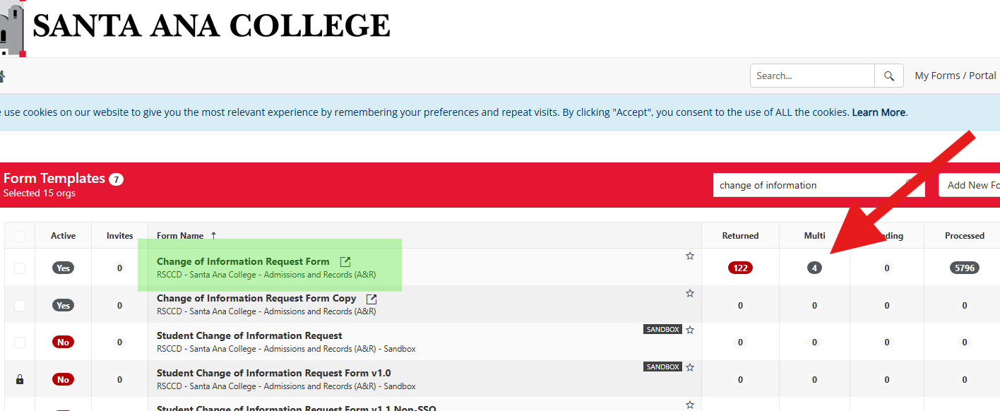

# Change of Information Request

Processing steps for student change of information requests through Dynamic Forms and Colleague.

**Total Steps:** 79 | **Time:** ~5 minutes

---

## Locating Request on Dynamic Forms

Step 1: Navigate to [https://dynamicforms.ngwebsolutions.com/AdminPortal](https://dynamicforms.ngwebsolutions.com/AdminPortal)

Step 2: Find Student Change of Information Request Form and Click Number Under Multi-Pending

Step 3: Click "Complete Form"

---

## Address Change

Step 1: Navigate to NAE on Colleague.

Step 2: Type in Student ID Number and press 
**Enter**.

Step 3: Detail into the **Address** field.

Step 4: Click **1**.

Step 5: Click **Insert**.

Step 6: Detail into the first line.

Step 7: Enter new address information.

Step 8: Click the **Status** field.

Step 9: Click on `Current`.

Step 10: Click **Save All**.

Step 11: Navigate back to the request on Dynamic Forms and finish processing.

---

!!! note
    For the complete 79-step guide with all procedures, refer to the [original Scribe guide](https://scribehow.com/viewer/Change_of_Information_Request__rmY2h1UGSBiwE09pRlFWjg?referrer=documents)
