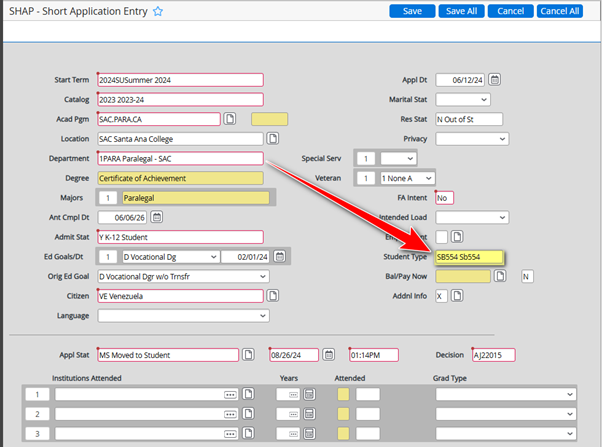

# SB554 Special Admit Forms (Dynamic Forms)

In Spring 2022, the Special Admit Form was updated to include **SB554**, which applies to adult learners in Continuing Education who have not yet graduated but wish to enroll in college credit courses. These students are similar to Special Admit high school students and require the Special Admit Form to be completed and their approved courses entered into STPE. Course approvals are handled by their Continuing Education (CE) counselor.

---

## Prerequisites

!!! warning
    Ensure the student has a **College Credit application on file** before processing. If no CC application exists, deny and explain that one must be on file to process.

- SB554 students **must always** have an approved petition signed off by Continuing Education counselors for every course.

---

## Processing Steps

1. Update Student Application
    - Navigate to **Colleague → SHAP**.
    - Update **Student Type** from `RGLR` to `SB554`
    - Keep **Admit Status** as `Y`

    

2. Update Student Type
    - Navigate to **Colleague → ASUM**.
    - Based on logic below, update **SPRO**.

    | Application Submitted for Requested Term? | Previous Application Submitted? | Procedure |
    |-|-|-|
    | ✓ | - | Update the Student Type from `RGLR` to `SB554` |
    | ✓ | ✓ | Insert a new line and add `SB554`; set the date to one day before the start of the requested term |
    | - | ✓ | Insert a new line and add `SB554`; set the date to one day before the start of the requested term |

    

    !!! note "Screenshot Placeholder"
        SPRO entry screenshot is in the original Word manual.

3. Update Student Organizations
    - Enter the **Student ID number** and press Enter.
    - Type **`1SB54`** into an open line and press Enter.
    - Enter the **start and end dates** of the semester the student is requesting.
        - You can type the term code to auto-populate dates (e.g., `2025SI` in both Start Date and End Date).

    !!! note "Screenshot Placeholder"
        COAF entry screenshot is in the original Word manual.

4. Update Student Waivers
    - Navigate to **Colleague → STPE**.
    - Enter the **waiver** for the student to register.
    - Enter **`NONRE`** for Overload Petition Status.

5. Register the Student
    - Navigate to **Colleague → RGN**.
    - Register the student in the requested classes.
    - If the course is full: **do not register** — notify the student the course was full and that they can register into a different section or waitlist themselves.
