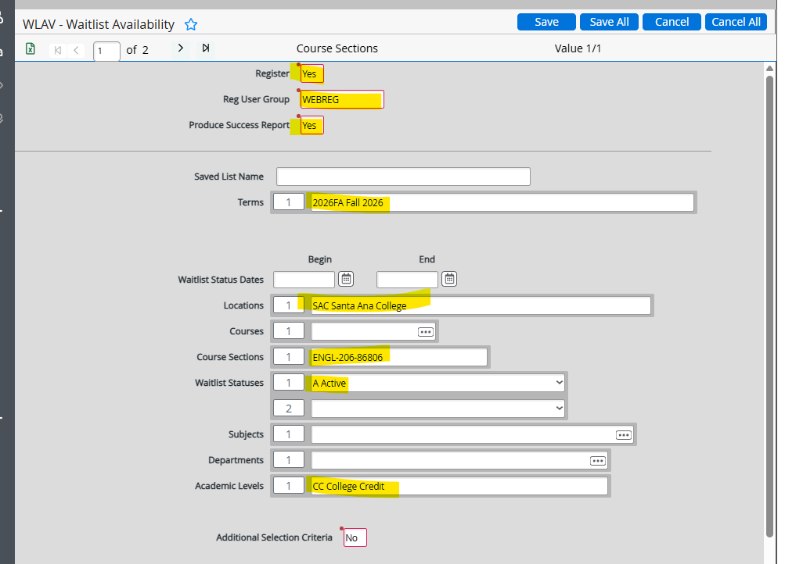

# Waitlist Rollover (Automated)

## Waitlist Rollover WLAV — After Term Start (Manual Daily)

The savelist is generated by ITS in SLCR and run in the background nightly.

- **WLAV.SL** — Use if the session you are running for has already started. Holds students that need to be rolled over for sections within that term that have not yet started.

## Manual Waitlist Rollover by Request

If the Division needs an individual WL rollover for one section during the day:

### 1. Access the WLAV screen
- Navigate to **Colleague → WLAV**.

### 2. Update the Necessary Fields

- Click **Save All** 3 times.

### WLAV Automated Process Setup