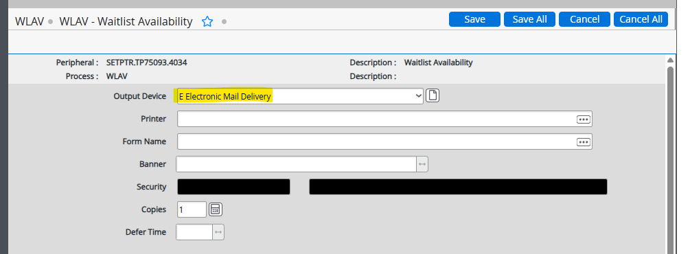

# Waitlist Rollover

## Overview

Waitlist rollovers register eligible students on waitlists into their respective courses.

- **WLAV.SL** — This savelist is generated by ITS in SLCR and run in the background nightly.

## Manual Waitlist Rollover by Request

If the Division needs an individual WL rollover for one section during the day:

### 1. Access the WLAV screen
- Navigate to **Colleague → WLAV**.

### 2. Update the Necessary Fields

- Click **Save All** 3 times.

## WLAV Automated Process Setup

We set up these automated processes once students are able to register for upcoming terms. This setup occurs twice a year.

### 1. Access the WLAV screen
- Navigate to **Colleague → WLAV**.

### 2. Update the Necessary Fields

- Click **Save All**.

### 3. Set Up the Email Notification

- Press **Enter**.

- Click **Save All**.

### 4. Set Up the Automated Process

- Click **Save All**.